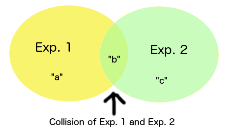
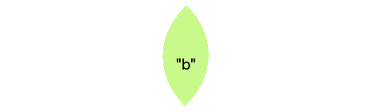
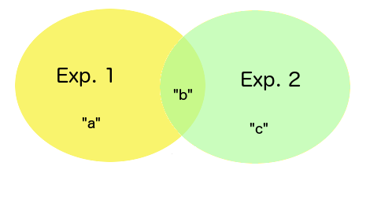
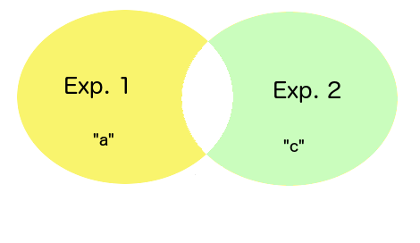
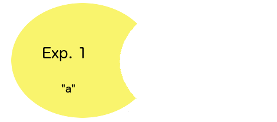

# Boolean algebra on expressions

To understand how boolean algebra works in regards to expressions, it might be feasable to start out with some boolean algebra theory. The easiest way to do such, is to define the 4 different boolean algebraic operators, using a simple figure. Below is a figure, we will refer to, during the rest of this chapter. Try to envision it, as you continue your reading.



The above is a visualization of two expressions, that partially overlaps. This creates 3 different sections, which we will refer to as *"a"*, *"b"* and *"c"*. *"a"* is the result of our first expression, *"c"* is the results of our second expression, and *"b"* is the parts of these two expressions that overlaps.

## Defining the boolean algebraic operators

There are four basic boolean algebraic operators in lambda expressions;

- &, boolean AND, union or *"intersection"* of two expressions
- |, boolean OR, product of two expressions
- ^, XOR, eXclusively OR'ed product of two expressions
- !, NOT, subtracting results from second expression from first expression

These four boolean algebraic operators, allows us to do *"math operations"* on our graph objects, resulting from two expression. This allows us to create one expression, and then apply another expression after our first, which we combine together with each other, using one of the four boolean algebraic operators, to produce some sort of result.

### Logical AND

The boolean algebraic AND operator, or & as it is written in lambda expressions, allows you to retrieve only the parts that overlaps each other. From our figure above, this would become the *"b"* parts.

Imagine I have one expression which yields all first names being *"John"*, and another expression yielding all last names being *"Doe"*. If I AND'ed these two expressions together, I would end up retrieving only the people having both a first name of *"John"*, AND a last name of *"Doe"*. Below you can find an example of such an expression.

```
_src
  John:Doe
  Jane:Doe
  John:Farmer
  Stanley:Kubrick
_dest
add:x:/@_dest
  src:x:/@_src/*/John&/@_src/*/=Doe
```

Notice the *"&"* parts in the middle of our **[src]** node's expression above. This will logically AND our two expressions together, and only return the results that can be found in BOTH of our expressions. Hence, the result becomes that of, our **[_dest]**, ending up having one additional node; `John:Doe`.

Referring back to our original figure in the beginning of this article, this means we'll end up with only the *"b"* parts as our results.



AND is said to return only the UNION or the *"intersection"* of our two expressions.

Notice, it doesn't matter which expression you start out with, and which you end with, when you AND two expressions together. Even if you flip your expressions around, the result will still be the same.

### Logical OR

OR on the other hand, will yield anything found in EITHER of our two expressions. If you exchange the *"&"* in our above Hyperlambda, the results in our **[_dest]** node will include *"John Doe"*, *"John Farmer"* and *"Jane Doe"*.

Going back to our original figure, this means we will end up with our result being anything from either of *"a"*, *"b"* and *"c"*.



OR is said to return the *"product"* of our two expressions.

Notice, it doesn't matter which expression you start out with, and which you end with, when you OR two expressions together. Even if you flip your expressions around, the result will still be the same.

### Logical XOR

XOR means eXclusively OR, and translates into English like *"give me anything found only in __one__ of the following expressions"*. Try to exchange the *"&"* in our original Hyperlambda with a *"^"* character, to use the XOR operator. Notice how this returns only *"John Farmer"* and *"Jane Doe"*, but **not** in fact *"John Doe"*, because he can be found in both result sets.

Going back to our original figure, this means what we are extracting from our result set, is only the *"a"* and *"c"* parts, but **not** the *"b"* parts. Anything that is the result of an intersection between both of our expressions is discarded. Besides from that, it is similar to OR, which is why it is called *"eXclusive OR"*.



XOR is said to return the *"product"* of our expressions, minus the UNION or the *"intersection"*.

Notice, it doesn't matter which expression you start out with, and which you end with, when you XOR two expressions together. Even if you flip your expressions around, the result will still be the same.

### Logical NOT

NOT subtracts the result of its second expression, from its first expression, and returns only the parts that can only be found in the first expression. Try exchanging the *"&"* parts of our original Hyperlambda with an exclamation mark *"!"*, and see the results. This of course, will return all people with a first name of *"John"*, **except** those also having a second name of *"Doe"*. Resulting in only *"John Farmer"* being our result.

Going back to our original figure, this results in only the *"a"* parts.



NOT is said to return the first expression, minus the UNION or *"intersection"* of our second expression.

Notice that when you NOT two expressions together, the order of your expressions is important, and if you flip your two expressions around, you will achieve a different result. Hence, with NOT, order counts. In all the other boolean algebraic operators, order is not important, the same way order is not important when adding or multiplying numbers together.


## Grouping sub-expressions

This is as far as I have come ...