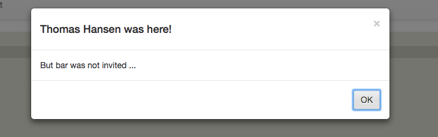
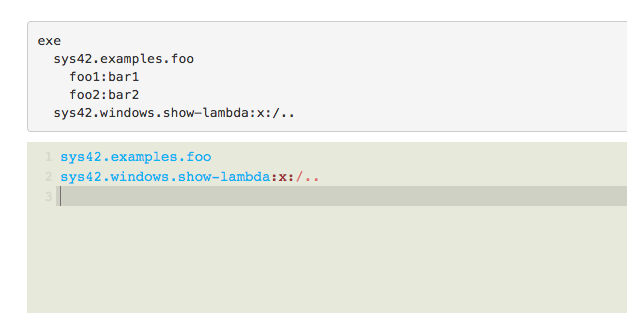

# Active Events

Active Events, as previously discussed, is a replacement to *"functions"* or *"methods*".

So what is an Active Event? Short answer; Everything you have done so far, is invoking Active Events. The **[sys42.windows.confirm]** parts from one of our previous chapters, is an Active Event. The **[set]** parts we've used several times during the course of this book, also happens to be an Active Event. I could go on, and list absolutely everything you've done so far. Active Events is the axiom, at which P5, and Hyperlambda, evolves around.

## Your first Active Event

You can easily create your own Active Events. In fact, let's do so. Execute the following code in your Apps/Executor.

```
create-event:sys42.examples.foo
  sys42.windows.confirm
    header:Foo was here!
    body:But bar was not invited ...
```

Then refresh your Executor web page, such that you reload your autocompleter for Active Events, remove all old code from the executor input, and type in `.foo`. When you have done, hold down CTRL as you click space bar. Execute the code, that should now hopefully look like the following, thanx to the wonders of autocompletion.

```
sys42.examples.foo
```

Probably few surprises here. Congratulations for the record, you have created your first reusable Active Event. Already at this point, you can consume this Active Event, in your own applications, as you see fit.

**Warning**; Before you go berserk creating your own Active Events, please realize, that if your server is rebooted, or your web server process for some reasons recycles, etc - Your Active Event will *vanish*! If you wish to create *"persistent Active Events"*, you'll need to declare them in e.g. a Hyperlambda file, and make sure this file somehow is executed, every time your web server process starts. This is easily done, by putting a Hyperlambda file, creating your Active Events, into the *"/system42/startup/"* folder inside of your *"/phosphorusfive/core/p5.webapp/"* folder. All files in this folder, are automatically executed, every time your web server process starts.

## Parametrizing your Active Events

To pass in arguments to an Active Event, is as easy as creating a child node. Let's first create an Active Event that can somehow handle our arguments first though. Notice, we will be using the same name for our Active Event as our first example. This will ensure that our original Active Event becomes overwritten, and replaced with our new implementation, without any extra effort necessary from our side.

```
create-event:sys42.examples.foo
  eval-x:x:/+/*/header
  sys42.windows.confirm
    header:{0} was here!
      :x:/../*/name?value
    body:But bar was not invited ...
```

Afterwards you can invoke your Active Event with a **[name]** argument. Below is an example.

```
sys42.examples.foo
  name:Thomas Hansen
```

Notice this time, that our confirmation window, is actually able to show the name of *"Thomas Hansen"*. Hence, it has obviously found our argument. The results of the above code, should resemble the following.



To return arguments from your Active Events are equally easy.

```
create-event:sys42.examples.foo
  return
    foo1:bar1
    foo2:bar2
```

Then invoke your Active Event with the following code.

```
sys42.examples.foo
sys42.windows.show-lambda:x:/..
```

As you can see below, clearly our Active Event has returned two nodes to us, after its invocation.



Often you only wish to return a single *"thing"* from your Active Events though, at which point you can do this, by using the **[return]** Active Event (yes, even the return *"keyword"* is an Active Event), and passing in whatever you wish to return, as the value of **[return]**. Below is an example.

```
create-event:sys42.examples.foo
  return:Hello World
```

Then invoke your event with the following.

```
sys42.examples.foo
sys42.windows.show-lambda:x:/..
```

At this point, the value **[return]**'ed from your Active Event, can be found as the value of your Active Event invocation node, like the following illustrates; `sys42.examples.foo:Hello World`.

