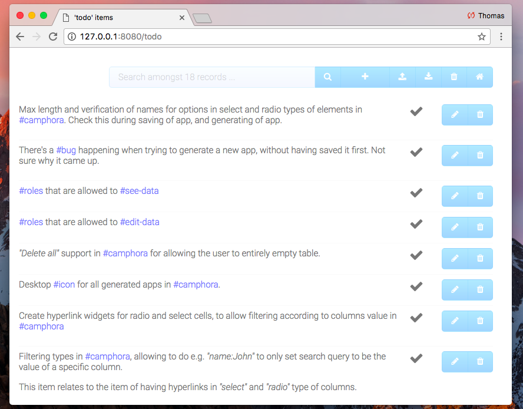
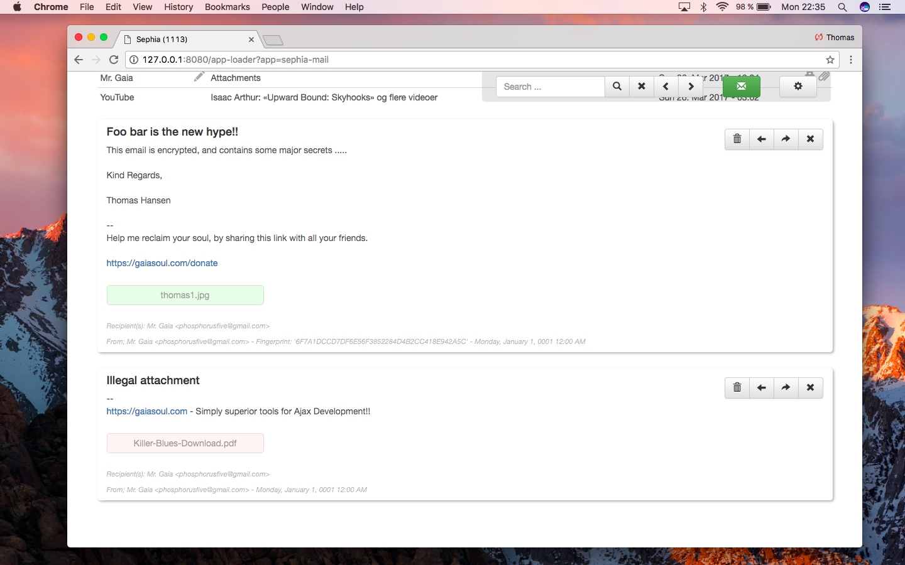
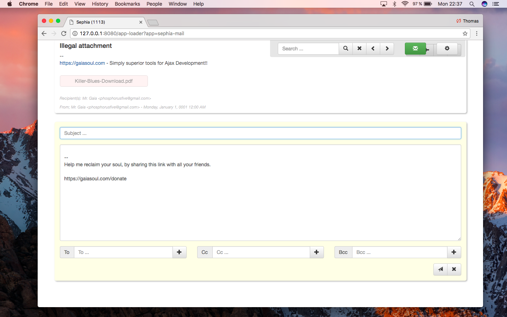
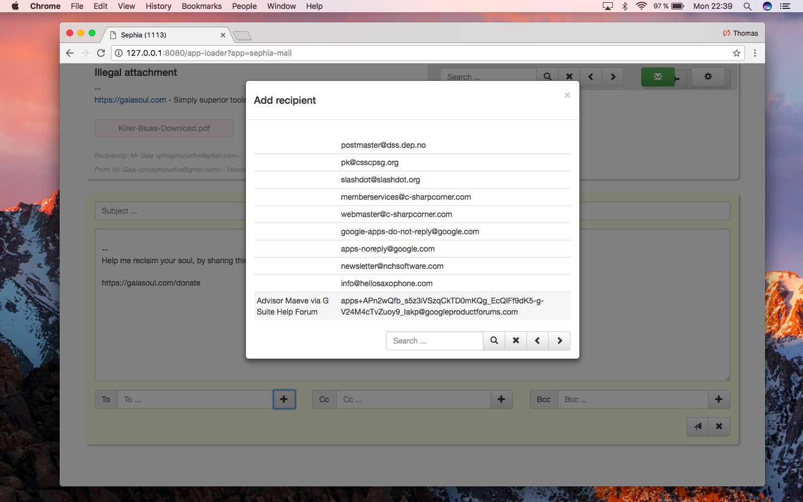
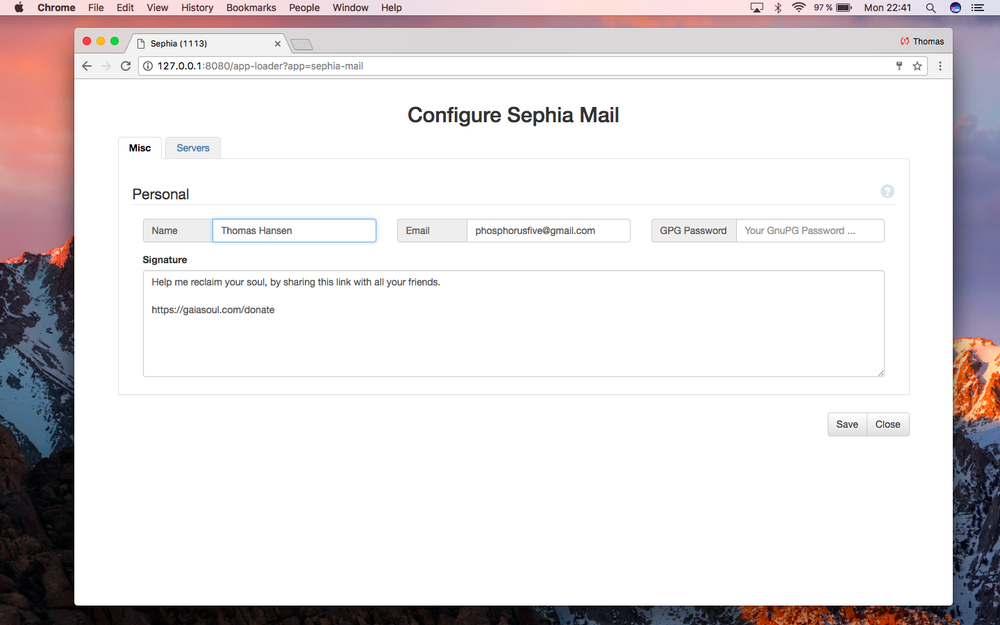
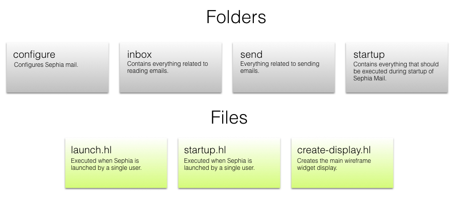
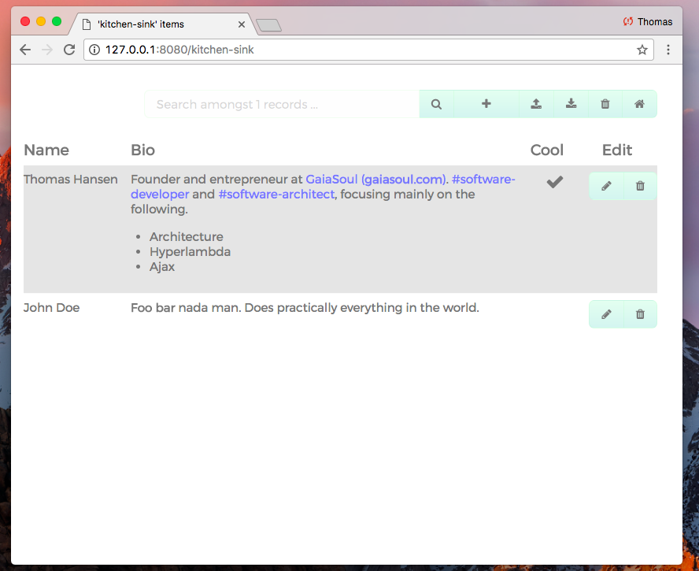
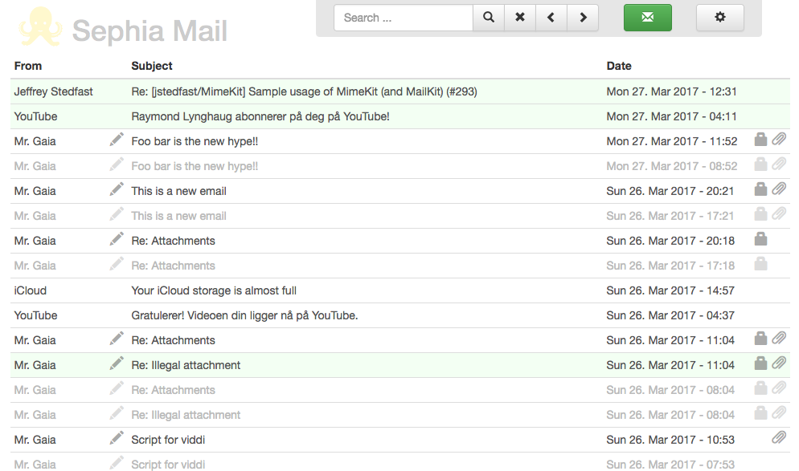

# Creating a PGP GMail clone

In this chapter, which is our last chapter, we will leverage everything we've learned, in order to create a complete web mail, or _"GMail clone"_, with support for PGP cryptography, eliminating spreading of viruses, and making it 100% perfectly safe to read your emails, without having to fear malware in any ways.

The system we will create, will resemble the following.



It will have the following features.

* PGP cryptography, both signing and encrypting/decrypting emails
* Send, reply and forwarding of emails through SMTP
* Fetching emails from a POP3 server
* Creating new emails
* A contact database, automatically populated by all incoming/outgoing emails
* Allow for adding/downloading attachments to/from your emails, but only safe file types, not capable of spreading any types of virus or malware
* It will be a multi user system

In addition, it will be configurable, and allow for its user(s) to configure his or her inbox. Technologies visited will be, among other things.

* Datagrids, or the ability to create repeating widgets, inside HTML tables
* Using and creating extension widgets
* We will be using the MySQL data adapters from P5
* We will be visiting the MIME Active events in P5
* We will also be consuming the POP3 and SMTP Active Events

Basically, the system will be a complete application, resulting in something that is highly usable, making you feel like you have really created and understood a complex and rich web application once you're done.

Unfortunately, such a system, requires dozens of files, in addition to thousands of lines of code, so the format of this book, simply won't _"cut it"_, and we're going to have to cheat a little bit on the coding parts.

The way we will cheat, is that [I have in fact created this system already](https://github.com/polterguy/sephia-five), and instead of having you type out the system in its entirety, I will [link you to its download](https://github.com/polterguy/sephia-five/releases/tag/v0.5), where you can find it, and walk you through the code that's already there.

Here are some more screenshots of the system. First viewing emails. Notice, you can have multiple emails up at the same time, in the same window, allowing you to read multiple emails, on e.g. your iPhone or Android, without having to do the difficult switch between windows. Notice also that it doesn't allow downloading of PDF files (which are a known source for spreading viruses).



Here is composing a new email. Notice, you can compose a new email, or reply to an existing email, while reading other emails. This allows you to easily copy and paste content from one email, into your reply, and/or your new email.



Here is how you'd add a recipient to your email. Notice the pager and search toolbar, which is actually the same extension widget we're using in the main inbox.



Here is how you'd configure the system, supplying POP3, SMTP and PGP settings, in addition to creating your own email signature, which is automatically appended into every email you send.



## Analysing the system

First of all, you'll need to [download Sephia Five](https://github.com/polterguy/sephia-five/releases/tag/v0.5). If you're reading this book in a paper format, you can find Sephia Five here; https://github.com/polterguy/sephia-five/releases/tag/v0.5

**Notice**; We will be using the 0.5 version in this book. Sephia Five is actually a fully fledged real project, and will probably be worked on, and extended in the future. However, to make sure you are seeing the same code, as I created when I wrote this book, we will have to use the first initial release, during the dissecting of the system. This will make it easier for me to reference files, line numbers, and so on in the system, as we dissect it - Without having these line numbers and file names disappear, as I refactor and further maintain the system in the future.

We will therefor be assuming that what you are actually using during the dissecting of the system in this chapter, is the **0.5 version of Sephia Five**, and not necessarily its latest release, which might look completely different in regards to its code structure.

If you wish to actually use Sephia Five in production, in your own company for instance, you'd probably want to make sure you download the latest **stable** release, which you can find [here](https://github.com/polterguy/sephia-five/releases). If you're reading this in paper format, you can go here; https://github.com/polterguy/sephia-five/releases

In [this video](https://www.youtube.com/watch?v=NEaIuv6HTjk), I am analysing the system, as it was in version 0.5. If you don't want to read everything below here, but rather have an easy to view YouTube video, analysing the system's structure instead - Feel free to view the video, instead of reading this chapter in its entirety, or in combination with reading the chapter - For then to download the system, and going through its code yourself. If you are reading this book in some sort of paper format, the video can be found here; https://www.youtube.com/watch?v=NEaIuv6HTjk 

### Pre-requisites

The first thing you will need to do, is to create a database for Sephia Five. You do not need to create its schema, but you will need an empty database. I would suggest calling your database *"sephia"*, and use MySQL Workbench to create it.

When you have done this, you will need a connection string in your web.config file, beneath your *"p5.webapp"* project. Below is an example of how you could create such a connection string.

```xml
<connectionStrings>
  <add
    name="sephia" 
    connectionString="server=localhost;User Id=root;password=YOUR_PWD;database=sephia;CharSet=utf8mb4;"
    providerName="MySql.Data.MySqlClient" />
</connectionStrings>
```

### Folder structure

When you have downloaded the system, it is crucial that you put the unzipped folder into the following folder; _"/phosphorusfive/p5.webapp/system42/apps/"_ - This is a special folder in System42, and kind of like your _"Program files"_ folder. Everything you drop into this folder, will become a System42 application, and automatically have its own navbar item link, do initialization during startup, etc.

When you have done this, it is important that you rename the folder, from its original name which probably is *"sephia-five-0.5"* to become *"sephia-mail"*. If you get funny bugs when you restart your web server process, and or start Sephia Five, this might be due to having not correctly changed the name of your folder.

Then you must either evaluate the *"startup.hl"* file yourself, or re-cycle your web server's process, such that this file becomes evaluated.

#### The "startup.hl" file

If you wish to see this file's code, you can check it out online [here](https://github.com/polterguy/sephia-five/blob/v0.5/startup.hl) - https://github.com/polterguy/sephia-five/blob/v0.5/startup.hl

This file will be invoked automatically by System42 during server reboot, or whenever your web server process restarts. This file must contain all the app initialization logic, which should be evaluated whenever the server process starts.

Typically, you'll add all your custom Active Events inside of this file, either directly or indirectly. What we have done here, is to first of all create an environment PATH variable, which is our **[p5.io.unroll-path.@SEPHIA]** Active Event at the top, in addition to evaluating **all** Hyperlambda files inside of our _"/startup/" folder.

The first Active Event creation, will make it more easy for us to access the main root folder for Sephia Five, by doing stuff such as for instance the following.

```
/*
 * This will list all files in your "/system42/apps/sephia-mail/" folder.
 */
list-files:@SEPHIA/
```

The second invocation to the **[sys42.utilities.execute-lambda-folder]** Active Event, makes sure that all Hyperlambda files in our _"@SEPHIA/startup/"_ folder is evaluated.

#### The "launch.hl" file

You can find the launch file [here](https://github.com/polterguy/sephia-five/blob/v0.5/launch.hl) - https://github.com/polterguy/sephia-five/blob/v0.5/launch.hl

When you load the navbar/menu in System42, it will traverse all application folders inside of the _"/apps/"_ folder, and check to see if the app contains a _"startup.hl"_ file. If it does, it will create a manu item for System42, beneath the _"Apps"_ folder, that once clicked, evaluates this Hyperlambda file.

Arguably, this becomes the equivalent of an application's main EXE file on Windows. Or its desktop icon if you like such analogies.

In our _"launch.hl"_ file, we will first of all verify that we have an authenticated user, by invoking **[whoami]**, and verify the user is actually logged in. We don't care about what role our user is, simply that it is an existing user, who have logged in with his username and password. This is done with the following code.

```
whoami
if:x:/@whoami/*/default?value
  throw:Sorry, Sephia Mail is only accessible for logged in users
```

Afterwards, we include Bootstrap CSS, and our own custom CSS file, in addition to the main CSS file for System42. The latter we do, since we rely upon some helper widgets, such as for instance **[sys42.windows.info-tip]**, which have CSS declared in the System42's main CSS file. Arguably, linking in the entire _"mail.css"_ file for System42, might be considered overkill, but we have chosen to do so currently for convenience reasons.

Then it creates the user's _"attachments"_ folder, for downloading email attachments, if this folder doesn't already exist. This will only happen the first time a user starts the system.

Then it sets the CSS class for the main _"cnt"_ widget on our page. This occurs on line 66 in the launch.hl file.

After that, it checks to see if the user has configured his sephia settings, and if not, it starts the configuration process, denying the user to proceed, before he has configured his SMTP/POP3/PGP account/keypair settings. This is ensured by having a **[return]** invocation, returning early, unless the user has created his configuration settings for the system.

Then finally, unless it returns early in the above step, it evaluates our _"@SEPHIA/create-display.hl"_ file.

#### Our "create-display.hl" file

The create-display file can be found [here](https://github.com/polterguy/sephia-five/blob/v0.5/create-display.hl) - https://github.com/polterguy/sephia-five/blob/v0.5/create-display.hl

This is our last file in the main root folder, and has one single responsibility; Create the main widgets on our page. It has little logic in fact, besides declaring our main wireframe HTML/widget structure, and have outsourced most of its logic, to other helper files. This allows us to create a clean separation of logic and UI, creating a cleaner and more reciliant architecture, arguably resembling that you're used to have from MVC frameworks, and similar types of architectures. Notice, this approach, could probably have been taken much further, but it's still quite strong already in the architecture of the system, as it is in its 0.5 version.

Besides from an initial invocation at the bottom to evaluate our _"@SEPHIA/inbox/show.hl"_ file, there are few things in this file, which you shouldn't already know well by now. One interesting thing though, can be found at line 130, where we create a hidden Ajax event, which we will consume from JavaScript, on the client side, to periodically poll the server and fetch new emails from our POP3 server. At line 143, we inject the JavaScript during initial creation, to immediately invoke this Ajax event, which is why once the system loads, it immediately creates a poll towards the server, to fetch new items from your POP3 account.

The fetching of emails from your POP3 server, could arguably be better. For one, it runs on the main GUI thread, which "locks" the system during fetching emails. But this is left as an exercise for the reader.

#### Our five folders

Besides from the above three files, the root folder of Sephia Five contains 5 folders;

* configure - Contains everything related to configuration of the system
* inbox - Everything related to browsing and reading emails
* media - CSS and images (actually only one image and one CSS file)
* send - Everything related to sending an email
* startup - Which we have already discussed further up

You can see this folder structure [here](https://github.com/polterguy/sephia-five/tree/v0.5) - https://github.com/polterguy/sephia-five/tree/v0.5

## Displaying emails (datagrid)

This mainly occurs in one file, our _"/inbox/show.hl"_ file. The file is 244 lines of code, and basically creates a datagrid, which it populates dynamically, according to content from our MySQL database.

The _"show.hl"_ file can be found [here](https://github.com/polterguy/sephia-five/blob/v0.5/inbox/show.hl) - https://github.com/polterguy/sephia-five/blob/v0.5/inbox/show.hl

This file takes optionally two arguments.

* __[filter]__ - Which is a search query to use as a filter condition
* __[offset]__ - Which transforms into an offset MySQL criteria for our SQL

These two arguments, are actually normally dynamically given to us, from our **[sephia.widgets.search-toolbar]** Active Event, which actually is a custom extension widget, wrapping our pager/filter toolbar. In fact, the only place we invoke this file ourselves, we do not pass in these arguments at all. These are hence arguably a part of the API necessary to expose, for our pager/filter toolbar, to function correctly.

However, regardless of whether or not you supply arguments when invoking the file, it perfectly databind the HTML table, by creating one tr HTML element, for each row it selects from the MySQL database.

First it invokes **[whoami]**, which returns the logged in user, and uses this as a criteria to its SQL select command, which it executes towards the database. Then at line 70, it executes this SQL command, which might have been modified further up, if a **[filter]** condition was supplied.

At line 79, it loops through all records returned from the above SQL command, and creates the tr HTML widgets necessary, to wrap a single _"row"_ in our datagrid.

Between line 84 and line 168, it dynamically creates the row's CSS class, according to whether or not the email is encrypted, signed, contains attachments, etc. Before it finally, at line 179 actually creates the widget, now parametrized according to the records' properties.

Notice, at line 183, we use a server side hidden property, to help us later recognize this widget's email id from our database. This will never leave the server, and end up being a server-side hidden property, exclusively used on the server, for later retrieving the actual email content, when a table row is clicked, etc ...

This file too, contains little logic, except for the logic necessary to dynamically create our table's content (tr rows) - And has outsourced most of its logic parts, to other files it invokes whenever some sort of interaction occurs on the page with the user.

At line 235, it invokes the Hyperlambda file that sets the HTML title of our page, before it finally sends over the JavaScript necessary, to make sure we scroll to the top of the page, since the paging widgets might have been theoretically clicked, while we were deep down on the page, reading an email.

The _"set-title.hl"_ file, is fairly self explaining at this point, but basically sets the title of our page, according to how many unread emails there are in our database, for the current user.

The _"set-title.hl"_ file can be found here [here](https://github.com/polterguy/sephia-five/blob/v0.5/inbox/set-title.hl) - https://github.com/polterguy/sephia-five/blob/v0.5/inbox/set-title.hl

## Reading emails

The next interesting file, is our _"read.hl"_ file, which basically has the responsibility of allowing the user to read a single email. It is invoked when a user clicks a single row in the inbox datagrid we walked through above, and simply displays a widget, wrapping the fields for our email, allowing the user to read the email.

The _"read.hl"_ file can be found online [here](https://github.com/polterguy/sephia-five/blob/v0.5/inbox/read.hl) - https://github.com/polterguy/sephia-five/blob/v0.5/inbox/read.hl

This file expects an **[email-id]**, and this argument is (obviously) mandatory, for the file to function correctly, when it is evaluated.

### Plugins for reader

This file has one very interesting trait, which is that it actually dynamically loads up all Hyperlambda files from the _"reader-action-buttons"_ folder, and dynamically injects these as plugin widgets, into the _"btn-group"_ widget at line 354.

You can find this plugins folder [here](https://github.com/polterguy/sephia-five/tree/v0.5/inbox/reader-action-buttons) - https://github.com/polterguy/sephia-five/tree/v0.5/inbox/reader-action-buttons

This plugin folder logic, is a common pattern in Phosphorus Five, which you will often see, allowing you to create dynamic plugins, and extendible systems. This allows us to easily create new plugins to our email system, without modifying the code in any ways. In fact, even though Sephia Five is surprisingly small, compared to its feature set, it still is surprisingly extendible and flexible, allowing for others to create plugins for it, to accommodate whatever need they may have for their email systems.

Notice how this is actually done with no more than 5 lines of Hyperlambda code, which you can see listed below.

```
list-files:@SEPHIA/inbox/reader-action-buttons/
  filter:.hl
load-file:x:/@list-files/*?name
add:x:/../**/create-widget/**/div/*/class/=~btn-group/./*/widgets
  src:x:/@load-file/*/*
```

You can find the original code listed above at line 20 in the _"read.hl"_ file.

### Checking if email is already open

Then at line 33, it checks to see if the email clicked is already open. If it is, it will not re-open the email, but simply scroll its existing reader widget into view, before returning early, aborting the rest of the execution of the file.

Notice though that in this logic we are obviously referencing an optional argument (which unfortunately was never documented in the original release), called **[force]**. This is necessary to allow our discard reply logic to be able to re-create the read email widget, before deleting its original reply widget. This logic allows us to close a reply for an email, re-opening a reader, at the same position as the reply widget was in our page.

### Building our read email widget

At line 58, we start by opening a connection to our database, invoking **[whoami]**, before starting to query our MySQL database for the email's data.

**Disclaimer**; From line 67 to line 171, we create the attachments widgets for the email. This logic should probably have been refactored, by for instance doing a lookup into a file, for legal types of attachments. The reason for this, is because the current logic is unfortunately not very DRY, since it is repeated at least in two different places.

If you wish to improve Sephia Five, this should probably be the first place you start out. A suggestion here, is to create a configuration file, wrapping your legal file extensions, and MIME types, for whatever attachment file extensions, you wish to allow your users to download from Sephia Five.

Its current code however, uses the **[apply]** Active Event, to dyanmically databind the sephia-attachments widget's **[widgets]** collection, that can be found at line 378.

It basically creates one button HTML element, for each attachment in our email, allowing the user to download the attachment. Notice though, that in the **[oninit]** of this button, it might theoretically change this button's **[onclick]** Ajax event, and modify its CSS class, if the attachment's file extension is considered an illegal type to download. This logic happens in the **[default]** at line 117.

**Notice**; Also these parts are ripe for refactoring and improvements!

At line 173, it retreievs all recipients for email, which includes the _"To"_, _"Cc"_ and _"Bcc"_ MIME headers for the email. At line 186, it uses a **[for-each]** loop, to dynamically create a comma separated string, which it later uses as the **[innerValur]** for displaying the recipe list. At this point, we simply concatenate all recipients, not caring if they are _"To"_, _"Cc"_ or _"Bcc"_ types of recipients.

Then at line 196, it retreieves tha actual email from our database, and makes sure the email is marked as read in the database at line 207.

The lines between 204 and 338 is fairly well documented in the code, and should be possible to be easily understood, according to their comments.

At line 338, it is entirely done retrieving and massaging the values returned from our database, and can create our widget, before it updates the title, since our read emails count has now (obviously) changed.

## Deleting an email

This logic should be fairly self explaining according to its comments, and can be found [here](https://github.com/polterguy/sephia-five/blob/v0.5/inbox/delete.hl) - https://github.com/polterguy/sephia-five/blob/v0.5/inbox/delete.hl

This file expects an **[email-id]**, being the database id for the email that is deleted, and will delete not only the email from the database, but also all attachments associated with the email on disc. Notice line 38, and how it invokes **[delete-file]**.

Notice, this file can be invoked both with a **[widget]** argument, being the ID of some widget on the page, which is contained within the reader widget for the email - Or, alternatively, as a pure business logic file, not dependent upon any GUI elements at all.

This file is invoked by the reader action button file called _"1-delete.hl"_. The numbers in front of the files in this folder, is there simply to allow us to have these buttons show up in a specific order.

## Action plugins for the read email widget

These four files should be fairly self-explaining, but basically allows the user to delete, reply, forward, and close an email.

**Disclaimer**; In general, I have tried to separate GUI as much as possible from logic, and in such a way, arguably create a View/Controller type of logic. I must confess though, that this important design principle, could arguably have been further empasized in Sephia version 0.5 - And that some areas could probably benefit from being further separated. However, if you wish, feel free to perceive this as homework. Still, already, this design principle is fairly well implemented in Sephia.

All the action plugins for reading emails, which are basically the four buttons in each email, can be found [her](https://github.com/polterguy/sephia-five/tree/v0.5/inbox/reader-action-buttons) - https://github.com/polterguy/sephia-five/tree/v0.5/inbox/reader-action-buttons

## Sending emails

The two most important files in these regards, are the _"create.hl"_ file, and the _"respond.hl"_ file. The _"create.hl"_ file, is the file responsible for creating all types of emails, and takes a bunch of arguments, which are fairly well documentet in the top of the file. You can find the file [here](https://github.com/polterguy/sephia-five/blob/v0.5/send/create.hl) - https://github.com/polterguy/sephia-five/blob/v0.5/send/create.hl

This file is used both when replying to an existing email, and when composing a new email. The only difference between these two operations, are which arguments you pass into the file when you evaluate it.

The _"create.hl"_ file, also has a send action plugins folder, which dynamically populate the widget with action buttons, according to the files in its folder.

In addition, it adds up the signature for the user, in the body, before going directly to its **[create-widget]** invocation. Depending upon whether or not an **[after]** argument was supplied, it will either append the widget into the main reader, or inject it after some other specified widget.

The widget creates one lambda event called **[sephia.get-email]**, which is arguably its most important function, returning the email data to its caller when invoked. Notice, this event must be invoked with the ID of the main wrapper widget for the send widget, otherwise it will not be evaluated. This is because you might have multiple send email widgets open at the same time, and this event needs to know which widget triggered the event. The event basically returns the email data to its caller.

To pass in the ID of the widget to a widget lambda event, is a common design pattern to make sure the widget lambda event is only evaluated, if it is supposed to. You can think of this pattern as the equivalent of passing in the this pointer in traditional OOP languages. Remember that all Active Events, including widget lambda events, are global events, and they will by default, all be evaluated, once you raise an event. Hence, to make sure only the correct lambda event is evaluated, in scenarios where we might have multiple instances of the same event - We must pass in the ID of the widget who's lambda event is supposed to be evaluated.

At line 157, we create an _"Ajax Drag and Drop Uploader widget"_, which is an extension widget in P5, called **[sys42.widgets.uploader]**. No surprises here, and it simply forwards the responsibility of actually saving the file uploaded, and creating an attachment widget to the file called _"upload.hl"_.

Notice, we had to create our own custom CSS class for this widget, to function in fullscreen mode. Feel free to check this out in the _"main.css"_ file for Sephia.

Below there, you can find some form elements, allowing you to construct a subject, body, and recipients. Possible improvements here, implies creating an extension widget for our recipients widgets, since these parts are repeating themselves quite a lot. Consider this homework ...

Apart from that, there should be few surprises here. Line 376 wraps all attachment widgets, and the div at line 399, wraps all action buttons, which are semantically similar to the read email action buttons discussed further up.

### The "respond.hl" file

This file simply injects some respond email logic, before invoking _"create.hl"_, now parametrized, according to the content of the email it is responding to, and what type of respond we're talking about. 

This file can be found [her](https://github.com/polterguy/sephia-five/blob/v0.5/send/respond.hl) - https://github.com/polterguy/sephia-five/blob/v0.5/send/respond.hl

It is evaluated both when we reply to an email, and when we forward an email.

It reads the email we're responding to from the database, and then forward its properties to our _"create.hl"_ file, discussed further up. Everything up to line 205 is simply retrieving the email's content. At line 213 we invoke our _"create.hl"_ file, before finally at line 224, we delete the reader widget, if one was given, and found on page.

This logic ensure that our reply widget is injected at the same position that our reader widget was in the DOM on the client side, ensuring a better workflow for inline responding to emails.

### The rest of the files for sending emails

There are 4 additional files important when creating, forwarding, and replying to emails. These are listed below.

* add-recipient.hl
* save-envelope.hl
* send-email.hl
* upload.hl

#### The "add-recipient.hl" file

This file simply creates a modal Ajax window, allowing the user to select a contact from the database, adding the contact's email address, into one of our three recipient's textboxes; To, Cc and Bcc.

The file is fairly self explaining, and could possibly benefit from some refactoring.

#### The "save-envelope.hl" file

This file saves the **[p5.smtp.send]** **[envelope]** to our MySQL database, and is invoked before an email is sent using our **[p5.smtp.send]** Active Event. Yet again, this is a fairly self explaining file at this point, and there are no surprises here. There is no GUI logic in this file at all.

#### The "send-email.hl" file

This file, is responsible for actually invoking our **[p5.smtp.send]** Active Event, and will first retrieve all contacts from our database, to make sure it gets the name parts correctly when sending our emails and constructing our MIME envelopes.

One interesting detail here, is that if it can't find the contact in our database, for one of our recipients, it will inject a new contact, with the name of _"Anonymous"_, to make sure we store all email addresses the system has seen, in its database.

At line 126, it inserts our attachments into our MIME envelope. Notice, this logic definitely would benefit from being refactored, since it's not very DRY.

Then at line 239, it creates a little trickery, to warn the user if he tries to send am unencrypted email. It basically works, by checking a ViewState value for its existance, and if it doesn't exist, it will check if all recipients have public keys, and if not, warn the user, and return early, aborting the rest of the execution of our file. It warns the user using a modal confirmation window at line 266 in the file.

When it has issued the warned to the user, it will insert the above mentioned ViewState value if the user clicks OK, and "recursively" invoke itself. Now with the above mentioned ViewState value set, which means it will not warn the user again, and simply force a send operation, even if the email will have to be sent without encryption.

At line 302, it cleans up this ViewState value, entirely removing it again, to make sure consecutive invocations of this file, tries to warn the user again.

Then at line 311, it checks to see if it should encrypt the email or not, at which point it will add up all recipients' public PGP keys into our envelope, before passing it on to **[p5.smtp.send]**.

Then finally, at line 351, it is ready to send the email, after having first saved the entire MIME **[envelope]** into our MySQL database, by invoking our _"save-envelope.hl"_ file.

Notice, our _"send-email.hl"_ file, returns either boolean true or false, depending upon whether or not the email was in fact sent or not. If it needs to display a warning to the user, about how the email couldn't be encrypted, it will return false, otherwise it will return true.

This return value, is referenced at line 68, in the file _"send.hl"_.

## The architectural abstracts

Here is an overview of the file system, that gives you a visual representation of the purpose of the different files and/or folders.



## Possible improvements

First of all, the types of legal attachments the user is allowed to download is not very DRY, and could probably benefit from being normalized, into some common function. It is repeated multiple places, and should probably be either a configuration file, or an Active Event created during system startup. Probably the first is the better solution, since it's not something that should be exposed to other parts of the system as a whole - Meaning, other applications.

This would result in that we could remove at least two or three duplicate pieces of logic, that largely resembles each other, with a single invocation, to a single file, which allows the system to be much more easily configured, to allow for other types of attachments, in user's personal configurations of the system.

There are other places where we could also become more DRY. For instance, where we create our add recipients widgets, for our send/reply widgets, we could probably have reduced repetition significantly, by creating a single extension widget, and consuming this three times.

In general, an estimates guess, is that if we walked through the entire system, to extract commonalities, we could reduce it from ~3700 lines of code, to roughly 2500 lines of code.

## Exponential productivity growth

Another thing, which once you get a more thorough understanding for P5, is that we could easily extract a lot of our system, and create reusable components out of it. For instance, our settings screen, could probably be extracted, to create a common library for creating settings, which could easily be reused in future applications.

The same is true for the widgets we are using, such as for instance the page/filter toolbar, which we consume at least twice in our application.

If we did, we could probably remove about half of the remaining code in our system, resulting in that the Sephia codebase itself, would end up at about roughly 1000 - 1500 lines of code, and that it instead would use a lot of reusable components, we could put into some common library.

This would effectively result in that our next app, of the same complexity, would basically be 50% done, before we've even created a single line of code in it, resulting in that we could easily have created an application, of the same complexity, in about half the time we spent creating Sephia.

This is a general trait when you create P5 applications, which actually leads to what I like to refer to as exponential software productivity growth, resulting in that for every single project you create, you become more and more productive for every time.

## Profiling Sephia Five against GMail

If you use for instance the inspect features of Google Chrome, or FireFox, to profile the differences between Sephia and GMail, you will probably be highly surprised. Below you can find a comparison matrix between GMail and Sephia Five.

|Type                     |GMail      |Sephia    |Factor    |
|-------------------------|-----------|----------|----------|
|Initial page load size   |      4.4MB|     0.3MB|       15x|
|Page load time           |     10.82s|      0.3s|       37x|
|HTTP requests            |        163|        11|       15x|

**Disclaimer**; GMail was testet on an external connection, while Sephia Five was tested on localhost. Still, even if you cut the initial page load time in 2, the average improvement from GMail to Sephia in regards to neutral parameters is more than 15x as good. Besides, the other two performance traits, are completely irrelevant of whether or not the test was conducted on localhost or externally.

Now GMail of course, has a lot of features that Sephia doesn't have. However, GMail does not feature encryption, and arguably, implementing cryptography in GMail, is impossible according to best practices - Unless GMail allows you to host their application at your own server.

Besides, how much more do you really need from your email program than being able to read, reply, forward and create emails - In addition to being able to quickly search your emails. Sephia does all of these things, for 1/15th of the _"cost"_ of GMail. Sephia is also Free Software and 100% ads free.

Notice, we could also have significantly improved Sephia, by stripping out Bootstrap for instance, which would have further reduced our HTTP requests and initial bandwidth consumption significantly. My guess is, that if we really tried hard, we'd get the number of requests down to 4, without compromising any features, or any of its design beauty. In addition, we could probably have reduced the initial page load size, to somewhere around 25-50KB.

Sephia was built in 5 days, by one man, from scratch, to what we have looked at in this chapter. I don't know how many developers GMail have, but I guess it's at least 10. GMail has been maintained for more than 10 years, and still with P5, we were able to arguably outperform GMail in 5 days, with one man, working 8 hours every day.

That's really the value proposition of P5. Sorry if this sounds like bragging, but these are neutral parameters, which you can easily verify for yourself. The test was conducted on Tuesday, the 28th of March, 2017. GMail might improve its codebase in the future, creating a more slick experience - However, at the time of this writing, we basically _"slaughtered"_ GMail, in 5 days. GMail is as far as I know, the largest online email provider system on the planet. And we outperformed it in 5 days, on neutral and scientifically verifiable metrics.

Let that sink in for a while please ...

### A UX comparison between GMail and Sephia Five

These kind of things tends to be in the eye of the beholder - However, there are some things we happen to know, through research being conducted in this area, by among others industry titans such as Jesse James Garrett. One of these things is, that the less buttons and choices we present our users with, the less confused, and more easily charmed our users tends to become by our systems. An old saying claims that an image says more than a thousand words, I will therefor finish up this book, with exactly 2.000 words, to let you decide for yourselves, which system is actually the best system, in regards to UX.

GMail screenshot.



Sephia Five screenshot. Notice that Sephia gives you a significant smaller and slicker UX, with much better workflow, and at least one order of magnitude less choices. When it comes to UX, **less is always more**!



Notice, this is before I even start rolling down GMail's rolldown menus, at which point the number of choices would have literally **exploded**. Besides, please notice that as you actually initially load GMail, you're actually given the choice of, quote; _"Click here to load a minimized version, that loads faster on slow devices"_. I am not even sure if I should comment on this to be honest with you, since I think GMail themselves pretty much wrapped up our conclusion for us here ...

Thank you for reading, have a nice day :)

Thomas Hansen

[Back to index](README.md)