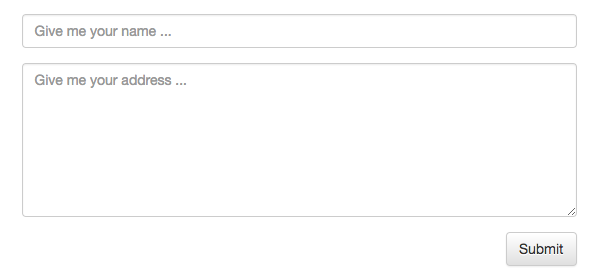
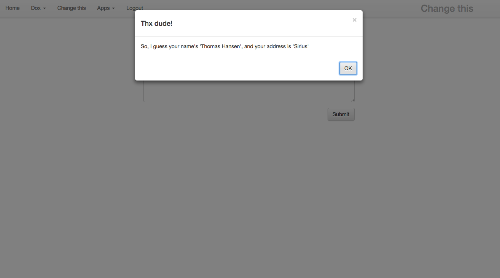

# Your first Ajax form

Arguably among your most important tasks in an Ajax application, is the gathering of input from your users. This is easily done with P5. Below is an example.

```
create-widget
  parent:content
  class:col-xs-6 col-xs-push-3 text-right
  widgets
    void:your_name
      element:input
      placeholder:Give me your name ...
      class:form-control
    literal:your_adr
      element:textarea
      placeholder:Give me your address ...
      class:form-control prepend-top
      rows:7
    literal
      element:button
      class:btn btn-default prepend-top
      innerValue:Submit
      onclick
        p5.web.widgets.property.get:your_name
          value
        p5.web.widgets.property.get:your_adr
          value
        eval-x:x:/+/*/body
        sys42.windows.confirm
          header:Thx dude!
          body:So, I guess your name's '{0}', and your address is '{1}'
            :x:/../*/p5.web.widgets.property.get/*/your_name/*?value
            :x:/../*/p5.web.widgets.property.get/*/your_adr/*?value
```

The above would result in something resembling the following.



There are several new concepts in the above piece of Hyperlambda, let's walk through them all, to get a grasp of exactly what is going on here.

First of all, we don't care about giving neither or main root **[container]** widget, nor our button widget any explicit IDs. This ensures that our widgets will have an *"automatic ID"* assigned to them. You can see this ID if you choose to view the HTML of your page.

Secondly, we create a simple *"input"* element, followed by a *"textarea"* element. Both of these widgets, we give an explicit ID, since we want to be able to easily retrieve their values later. This also helps your browser to *"semantically understand"* what it is looking at, which might play a role during autocompletion of forms, and such. Notice how the *"input"* element is created as a **[void]** widget, while our *"textarea"* element is created as a **[literal]** widget. This is important for these particular types of HTML elements.

The CSS class `class:col-xs-6 col-xs-push-3 text-right`, that we declared as arguments to our main **[create-widget]** node, simply makes sure our form is centered on the screen, consuming half its available width, and right aligns our button further down in its **[widgets]** collection. The *"prepend-top"* parts of the CSS classes of the textarea and our button, simply gives us some additional spacing between our widgets. The *"form-control"* CSS classes, are from [Bootstrap CSS](http://getbootstrap.com/css/). In fact, so are most of the CSS classes used in the above example.

## Retrieving form data

Probably the most complex parts above, is the stuff that's happening in our **[onclick]** event handler. To ease the understanding of it, let's isolate the Hyperlambda of our **[onclick]** Ajax event, and closely examine it.

```
onclick
  p5.web.widgets.property.get:your_name
    value
  p5.web.widgets.property.get:your_adr
    value
  eval-x:x:/+/*/body
  sys42.windows.confirm
    header:Thx dude!
    body:So, I guess your name's '{0}', and your address is '{1}'
      :x:/../*/p5.web.widgets.property.get/*/your_name/*?value
      :x:/../*/p5.web.widgets.property.get/*/your_adr/*?value
```

Initially we retrieve the values of our *"your_name"* input element, and our *"your_adr"* textarea element, with our two **[p5.web.widgets.property.get]** invocations. Then we show a modal confirmation window, with the data supplied by the user of our application. However, before we show this modal confirmation window, there's an invocation to `eval-x`. This simply *"forward evaluates"* the expressions found in our **[body]** node. Since this is a formatted string, with its formatting values pointing to the results of our **[p5.web.widgets.property.get]** invocations, this means that when **[sys42.windows.confirm]** executes, its **[body]** argument will be a static string, being the product of our formatting expressions, having its *"{n}"* parts, exchanged with its n'th child node's result.

The above `:x:` parts of our Hyperlambda, are in fact what we refer to as *"lambda expressions"* These allows you to reference other nodes in your lambda structure. If you have some knowledge of XPath, the similarities might be obvious.

The invocation to **[sys42.windows.confirm]**, simply creates a modal Ajax confirmation window for us. This Active Event expects the arguments **[header]** and **[body]**. All in all, this should result in something resembling what the image below shows us.



### Lambda expressions

Of all the concepts in P5, *"lambda expressions"* are probably the most complex. They are however crucial for the understanding of P5, so let us start out by dissecting the first expression in our Hyperlambda above, the `eval-x:x:/+/*/body` parts. The first part of our code, the `eval-x` parts, is an Active Event invocation, that forward evaluates the resulting nodes, of the lambda expression it is given. The `:x:` parts, is a type declaration, and simply means that the value of our node, is of type *"lambda expression"*. After these two parts, comes our actual expression.

#### Dissecting the expression

Here we will dissect the expression `/+/*/body`, to create a thorough understanding of what expressions are, and how you can use them yourself, in your own code. An expression consists of 0 or more *"iterators"*. Each iterator starts out with a slash *"/"*. Each iterator reacts upon the results of its previous iterator.

To start out with the components we see above, in the order they appear, we must start out with the `/+` iterator. This makes it possible to reference the *"next sibling"* node, which means for our above `eval-x` invocation, that it will reference the **[sys42.windows.confirm]** node. This is because of that the *"next node"* after the **[eval-x]** node, happens to be the **[sys42.windows.confirm]** node.

The `/*` iterator that follows, will reference all children nodes of the **[sys42.windows.confirm]** node. This gives us a result set containing **[header]** and **[body]**.

The `/body` iterator that follows, will remove all nodes not having the name of *"body"*. Resulting in that we've now created a reference to the **[body]** node, as an argument to our **[eval-x]** invocation. So our above expression, hence *"points*" to our **[body]** node, after the expression has been evaluated. This means that our `eval-x` invocation, will forward evaluate the expression found in our **[body]** node above.

To *"forward evaluate"* an expression, simply means evaluating it, and exchanging the expression, with a constant being the value of whatever the expression points to. Hence, after our **[eval-x]** invocation, our **[body]** node, will no longer contain an expression, but the constant results of our expression. This is a trick often applied in Phosphorus Five when passing in arguments to Active Events.

#### Conceptualizing expressions

An expression can point to one or more nodes, and hence serves as a *"node pointer"*. This way of referencing nodes, is unique to Hyperlambda, and what allows you to retrieve and change nodes in your lambda objects.

These expressions are in fact so powerful, that Hyperlambda have no means of declaring *"traditional variables"*. However, everything can in fact vary in Hyperlambda. Any node can have its name, value, and children collection modified, during the execution of the said lambda. This allows you to use everything in your lambda tree structure as a *"variable"*, and change it, removed it, add to it, as you see fit, during the execution of your lambda.

To create a useful mind model for expressions, for those acquinted with XPath and XSLT, it might be useful to perceive Hyperlambda as a combination of XML and XSLT, and lambda expressions as the equivalent of XPath.

Although Hyperlambda, per se, doesn't contain any explicit variables - By convention, you will often find that nodes purely intended to contain data of some sort, are prefixed with either an underscore "_", or a period ".". The reasons for this, is because the Hyperlambda execution engine, will ignore nodes starting with an underscore, or a period, and not attempt to raise these as Active Events.

You will also often find yourselves declaring nodes intended to be used as variables, before you reference them, although technically, this is not necessary. This allows you to use the *"variable iterator"*, which starts out with `/@_x`, where **[_x]** is the name of some node, declared before the code that is referencing it.

[Chapter 5, Lambda expressions](chapter-5.md)